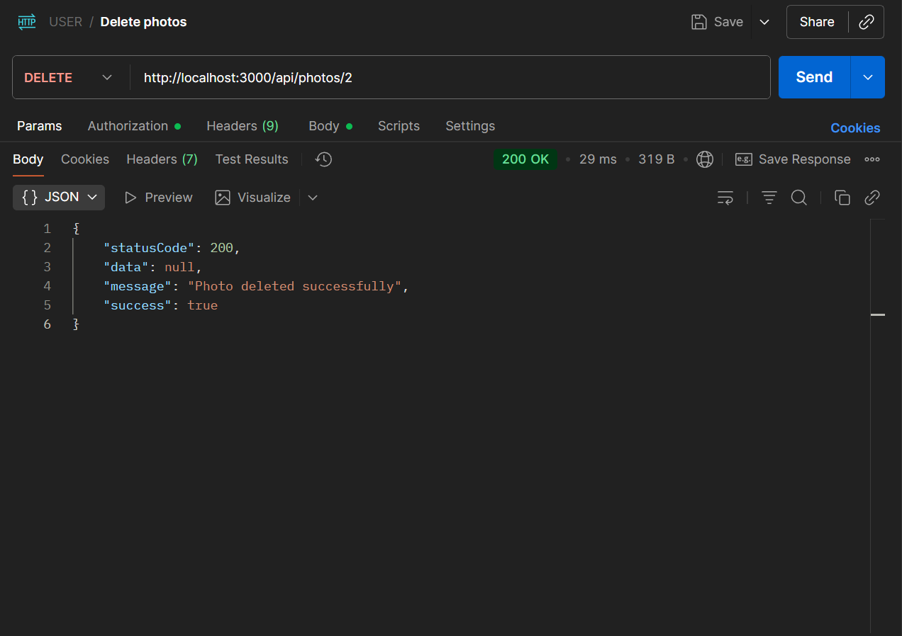
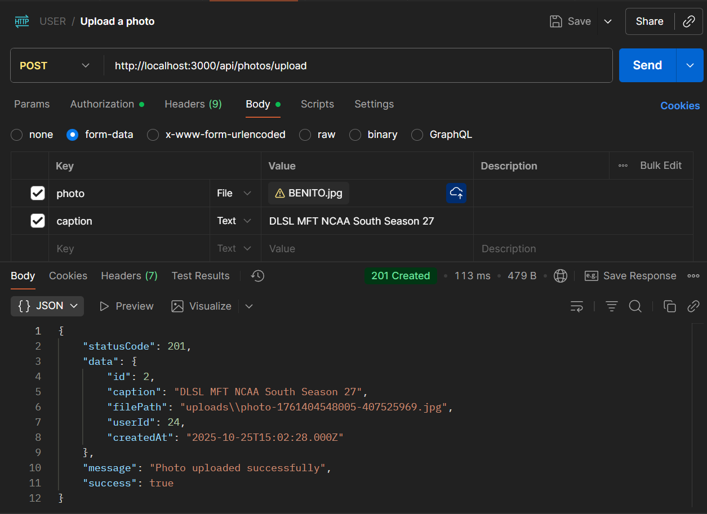
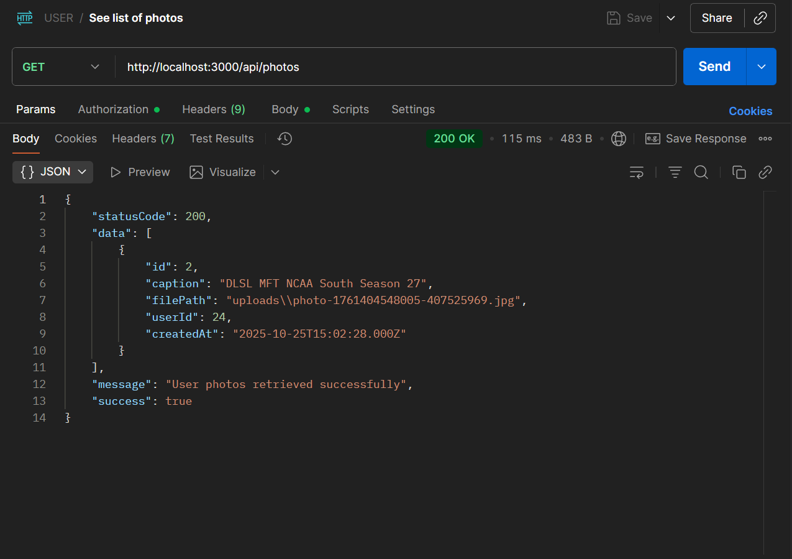

# GT: Multi-Part File Upload

This project is a simple Node.js + Express API that allows users to upload photos with captions.  
The uploaded files are stored in the `/src/uploads/` folder (inside the project root), and file information is saved in the database.

---

## 🚀 Features
- Upload photos using Postman
- JWT authentication
- File storage handled by **Multer**
- View and delete uploaded photos
- Access uploaded files via browser (e.g., `http://localhost:3000/uploads/filename.jpg`)

---

## 🖼️ Program Output

### 🗑️ Delete (Postman)

### 📤 Upload (Postman)

### 📋 List (Postman)

